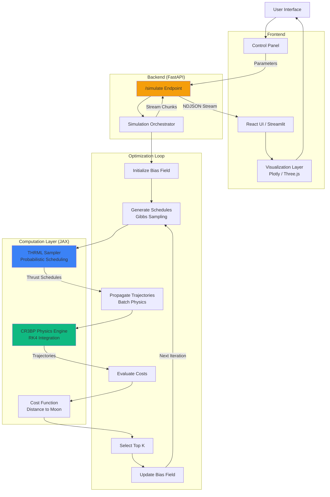
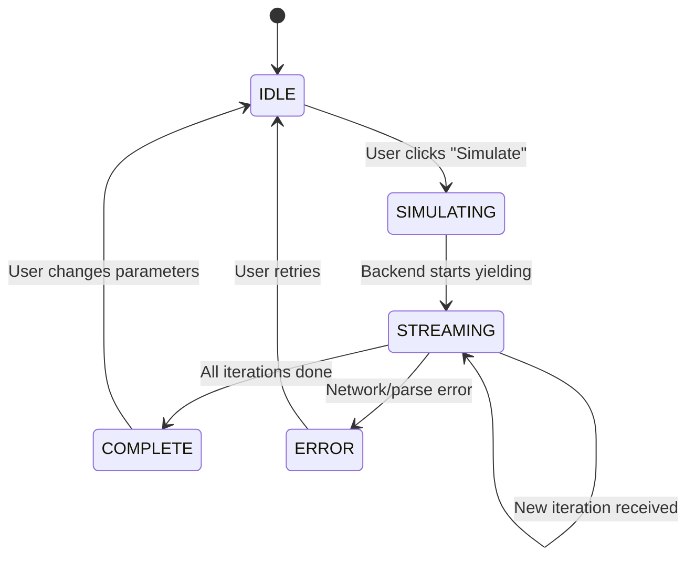

# System Design Document

## Project Overview

The Cislunar Trajectory Sandbox is a research/educational tool that investigates probabilistic inference as a strategy for generating structured thrust schedules to warm-start deterministic optimal-control methods for low-thrust Earth-to-Moon transfers.

**Core Innovation**: Using THRML (a JAX-based probabilistic graphical model library) to sample physically-meaningful thrust schedules that help classical solvers converge.

## Architecture Overview



## Data Flow

### 1. User Request → Backend

**User Input** (via UI controls):
```json
{
  "num_steps": 5000,
  "batch_size": 50,
  "coupling_strength": 0.5,
  "mass": 1000.0,
  "thrust": 10.0,
  "isp": 300.0,
  "initial_altitude": 400.0,
  "method": "thrml",
  "dt": 0.01,
  "num_iterations": 50
}
```

**FastAPI receives** → Normalizes thrust → Computes initial state

### 2. Iterative Optimization Loop

For each iteration (1 to `num_iterations`):

1. **Generate Thrust Schedules** (`generative.py`):
   - Input: Current bias field, coupling strength
   - THRML samples via Gibbs sampling
   - Output: `(batch_size, num_steps)` binary schedules

2. **Propagate Physics** (`physics.py`):
   - Input: Initial state, thrust schedules
   - RK4 integration of CR3BP equations
   - Output: `(batch_size, num_steps+1, 4)` trajectories

3. **Evaluate Cost**:
   - Compute distance from final position to Moon
   - Select top K% (default 10%)

4. **Update Bias Field**:
   - Average best schedules → new bias
   - Guides next iteration toward better solutions

### 3. Backend → Frontend Streaming

**Streamed Response** (NDJSON - one JSON per line):
```json
{"iteration": 1, "total_iterations": 50, "trajectories": [...], "best_trajectory": [...], "best_cost": 1234.5}
{"iteration": 2, "total_iterations": 50, "trajectories": [...], "best_trajectory": [...], "best_cost": 987.3}
...
```

**Frontend consumes**:
- Parses each line as JSON
- Updates visualization in real-time
- Shows "ghost" trajectories (exploration) + best trajectory (exploitation)

## State Management

### Backend State (per simulation)
- **Immutable**: User parameters (mass, thrust, etc.)
- **Evolving**: Bias field (updated each iteration)
- **Random**: JAX PRNG key (split each iteration)

### Frontend State
- **Simulation State**: `IDLE | SIMULATING | COMPLETE | ERROR`
- **Current Data**: Latest iteration's trajectories
- **History** (optional): Store all iterations for replay

### State Transitions



## Error Handling Strategy

### Backend Errors

1. **Physics Divergence**: If trajectories grow unbounded (> 10 in normalized units)
   - Log warning, continue with remaining trajectories
   - If entire batch diverges → yield error chunk

2. **THRML Import Failure**: Fallback to random schedules
   - Already implemented in `generative.py`

3. **Invalid Parameters**: FastAPI Pydantic validation
   - Return 422 Unprocessable Entity

### Frontend Errors

1. **Network Failure**: Display error banner, allow retry

2. **JSON Parse Error**: Skip malformed chunk, continue consuming stream

3. **Rendering Overload**: Limit trajectories displayed (already implemented - send subset)

## Normalization & Units

### Physical Units → Normalized (CR3BP)

| Quantity | Physical | Normalized | Conversion |
|----------|----------|------------|------------|
| Length | km | L* = 384,400 km | `x_norm = x_km / L_STAR` |
| Time | seconds | T* = 375,200 s | `t_norm = t_s / T_STAR` |
| Mass | kg | M* = 1000 kg | `m_norm = m_kg / M_STAR` |
| Velocity | km/s | V* = L*/T* | `v_norm = v_kms / V_STAR` |
| Acceleration | km/s² | A* = L*/T*² | `a_norm = a_kms2 / A_STAR` |

### Key Reference Points (Normalized)
- **Earth**: `(-μ, 0)` where `μ = 0.01215`
- **Moon**: `(1-μ, 0) ≈ (0.98785, 0)`
- **Earth Radius**: `6378 / 384400 ≈ 0.0166`
- **Moon Radius**: `1737 / 384400 ≈ 0.0045`

## Performance Considerations

### Backend
- **JAX JIT Compilation**: First call is slow (~10s), subsequent calls fast (<1s)
- **GPU Acceleration**: If available, batch propagation is ~10x faster
- **Batch Size vs Iteration Trade-off**: 
  - Larger batch → better exploration per iteration, slower per iteration
  - More iterations → better convergence, longer total time

### Frontend
- **Trajectory Rendering**: Only send subset (5 best + 5 random)
- **Animation**: Use `requestAnimationFrame` for smooth updates
- **Three.js**: Reuse geometry, update vertex buffers instead of recreating

## Future Extensions

1. **Classical Solver Integration** (CasADi + IPOPT):
   - Take best THRML schedule → smooth → refine to dynamically-feasible trajectory
   - Measure improvement in solver iterations

2. **Constraints**:
   - Eclipse windows (no thrust in shadow)
   - Phase angle constraints
   - Fuel budget

3. **Multi-fidelity Models**:
   - Use faster 2-body patched conics for early iterations
   - Switch to CR3BP near Moon

4. **Real Mission Data**:
   - ARTEMIS trajectory comparison
   - Launch window analysis
